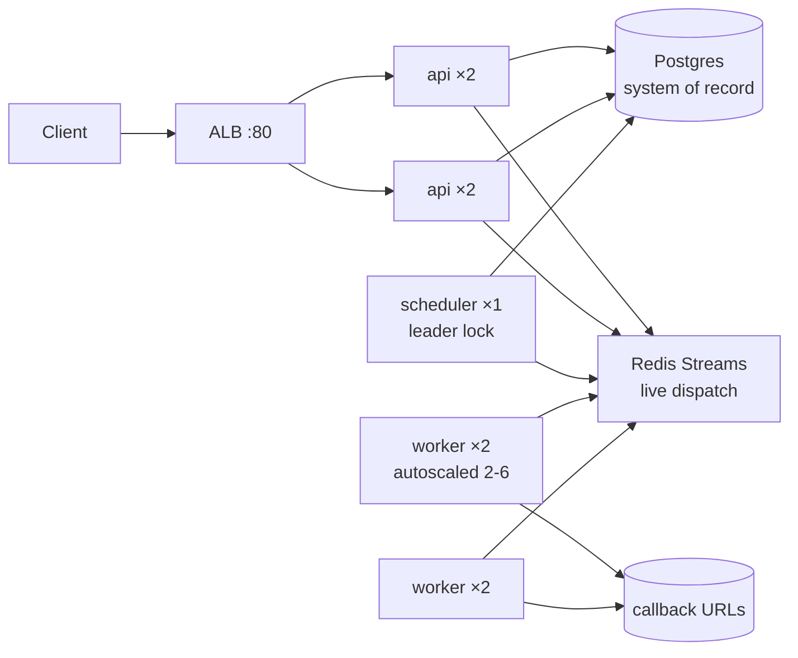

# Job Scheduler Platform

[](https://github.com/BurhaanAshraf/job-scheduler-platform/actions/workflows/ci.yml)

Durable background-job platform in Go: submit jobs over HTTP, run them now,
later, or on cron schedules. Webhook delivery with retries, exponential
backoff, a dead-letter queue, per-client rate limits, and Prometheus
observability. PostgreSQL is the system of record; Redis Streams is live
dispatch. Three stateless binaries (`api`, `scheduler`, `worker`) run on
Docker Compose locally and on AWS ECS (Fargate) in production.

## Contents

* [Features](#features)
* [Architecture](#architecture)
* [Tech stack](#tech-stack)
* [Prerequisites](#prerequisites)
* [Quickstart](#quickstart-local)
* [Configuration](#configuration)
* [API reference](#api-reference)
* [Concepts](#concepts)
* [Observability](#observability)
* [Testing](#testing)
* [Production](#production-aws)
* [Project layout](#project-layout)
* [Design tradeoffs](#design-tradeoffs)
* [Troubleshooting](#troubleshooting)
* [Contributing](#contributing)
* [License](#license)

## Features

* **Deferred + recurring work** — `run_at` one-shots, cron expressions, cancel-before-start, retry dead jobs
* **Exactly-once effects via idempotency keys** — byte-identical replays return the same job (200); same key + different payload is a 409 conflict
* **Durable execution** — attempts recorded per try; exhausted jobs go to the dead-letter queue (`GET /v1/dead-letters`)
* **Webhook delivery** — 10s timeout, SSRF guard (public targets only), method-preserving redirect handling
* **Multi-tenant auth** — bearer API keys stored as SHA-256 hashes, provisioned by CLI, revocable in Postgres
* **Rate limiting** — 60 req/min per key, sliding window in Redis, `Retry-After` on 429
* **Observable** — `/healthz` (dependency-checked), `/metrics` (Prometheus), structured JSON logs, CloudWatch alarms in prod

## Architecture



> **Detailed architecture diagram**: See [`docs/architecture.mmd`](docs/architecture.mmd) for a full-annotated Mermaid diagram with observability, CI/CD, and network topology details.

Request path: `POST /v1/jobs` persists the job in Postgres, enqueues it in the
`jobs:ready` stream, and returns the id. The single leader scheduler promotes
due jobs and spawns cron instances; workers claim stream messages, POST the
payload to `callback_url`, and record the attempt. Cron, retries, and cron
instance spawning are all driven through the same stream, so every leg is
visible via `job_id` correlation in the logs.

## Tech stack

| Layer | Choice |
|---|---|
| Language | Go 1.27, stdlib `net/http` router |
| System of record | PostgreSQL 16 (`jobs`, `job_executions`, `cron_jobs`, `api_keys`) |
| Live dispatch | Redis 7 Streams (consumer groups) + Lua for atomic promotion |
| Containers | Multi-stage Docker images with binary `-healthcheck` modes |
| Local | Docker Compose (api, scheduler, worker, postgres, redis, migrate, callback sink, Caddy TLS proxy) |
| Prod | AWS `ap-south-2`: VPC, RDS, ElastiCache, ECR, ECS Fargate, ALB, Secrets Manager, CloudWatch |
| CI/CD | GitHub Actions: lint + race tests on every push; OIDC-federated deploy to ECS on merge to `main` |

## Prerequisites

* Docker + Docker Compose v2
* Go 1.27+ and `golang-migrate` (only for running outside Compose)
* AWS CLI (only for production deploy)

## Quickstart (local)

```bash
cp .env.example .env        # set a real POSTGRES_PASSWORD
docker compose up -d --build
docker compose ps           # all services healthy (migrations run automatically)
curl localhost:4000/healthz # {"status":"ok"}
```

Provision a key (raw value is shown once — save it):

```bash
RAW=$(python3 -c 'import secrets;print(secrets.token_hex(32))')
HASH=$(python3 -c "import hashlib;print(hashlib.sha256('$RAW'.encode()).hexdigest())")
docker compose exec -T postgres psql -U burhaan -d job_scheduler -c \
"INSERT INTO api_keys (id, client_name, hashed_key, created_at) VALUES \
(gen_random_uuid(), 'demo', '$HASH', NOW());"
```

Submit a job and watch it complete (the local sink receives the webhook):

```bash
curl -X POST localhost:4000/v1/jobs -H "Authorization: Bearer $RAW" \
  -H 'Content-Type: application/json' -d '{
    "type": "demo", "payload": {"hello":"world"},
    "run_at": "2026-10-04T00:00:00Z", "max_attempts": 3,
    "idempotency_key": "demo-001",
    "callback_url": "http://callback:8080/hook"}'
curl localhost:4000/v1/jobs/<id> -H "Authorization: Bearer $RAW"
# {"status":"done","attempts":1,...}
```

Repeat the POST byte-identically → `200` with the same id (idempotent).
`GET /v1/dead-letters` lists exhausted jobs; `POST /v1/jobs/{id}/retry`
re-queues one. Cron: `POST /v1/cron-jobs` with `cron_expression` and a
`job_template`; disable with `PATCH /v1/cron-jobs/{id} {"enabled":false}`.

## Configuration

| Variable | Required | Meaning |
|---|---|---|
| `JOB_SCHEDULER_DB_DSN` (`DB_DSN` fallback) | yes | Postgres DSN (secret in prod, never in task defs) |
| `REDIS_ADDR` | yes | `host:port` of Redis |
| `REDIS_PASSWORD` | no | Empty = no auth |
| `API_PORT` | yes | HTTP port (`4000`) |
| `LOG_LEVEL` | no | `debug/info/warn/error` (default `info`) |
| `DB_MAX_CONNS` | no | Pool size per service (default `10`) |
| `SCHEDULER_POLL_INTERVAL` | no | Dispatch tick (default `500ms`) |

`POSTGRES_PASSWORD` is compose-only (builds the container and the default
DSN); app code never reads it.

## API reference

Auth: `Authorization: Bearer <raw-key>` on every `/v1/*` route.
`/healthz` and `/metrics` are public.

| Method & path | Meaning |
|---|---|
| `POST /v1/jobs` | Submit (`type`, `payload`, `run_at`, `max_attempts`, `idempotency_key`, `callback_url`) → `201` (+ `Location`-style `id`) |
| `GET /v1/jobs/{id}` | Job status, attempts, `last_error` |
| `GET /v1/jobs` | List/filter (paged, capped at 100) |
| `DELETE /v1/jobs/{id}` | Cancel if unstarted (`204`), else `409` |
| `POST /v1/jobs/{id}/retry` | Re-queue a `dead` job only |
| `GET /v1/dead-letters` | Exhausted jobs |
| `POST /v1/cron-jobs` | Create schedule (`cron_expression` + `job_template`) |
| `PATCH /v1/cron-jobs/{id}` | Enable/disable |
| `GET /healthz` | `200 {"status":"ok"}` when Postgres + Redis reachable, else `503` |
| `GET /metrics` | `jobs_submitted/completed/failed_total`, `queue_depth` |

Error shape: `{"error":{"code":"...","message":"..."}}` with `400` validation,
`401` auth, `404` unknown id, `409` state/idempotency conflicts, `429` +
`Retry-After: 60` over quota.

## Concepts

* **Idempotency** — `idempotency_key` is unique per client: same bytes, same
  job; same key with different content is rejected so retries never fork.
* **Retries & backoff** — `max_attempts` (1–5 typical) with 1s→2s→4s→… delays;
  each attempt is a row in `job_executions` with the callback's status code.
* **Dead letters** — attempts exhausted → `dead` with `last_error`; fix the
  receiver, then retry explicitly. Nothing retries forever silently.
* **Rate limits** — 60/min per key across all routes (Redis sliding window).
* **SSRF guard** — `callback_url` must be public http(s); private/internal
  targets are rejected at submit time.
* **Scheduler leadership** — Redis lock elects exactly one scheduler; logs
  show `acquired scheduler leadership`; failover is automatic.
* **Cron** — standard 5-field expressions, one instance per minute boundary,
  disable without deleting.

## Observability

* Health: ALB target checks hit `/healthz`, which itself pings Postgres and
  Redis — a green target means the app can actually work.
* Metrics: scrape `/metrics`; alert on `jobs_failed_total` growth and
  sustained `queue_depth`. Prod adds CloudWatch alarms for failure rate,
  queue backlog, ECS task health, and billing.
* Logs: JSON with `job_id` on every leg (submit → promote → execute), so
  `grep job_id` reconstructs a job's whole lifecycle.

## Testing

```bash
go build ./... && go vet ./...
go test ./... -p 1 -count=1        # serial: integration tests share one PG+Redis
```

`cmd/api` holds handler/router/auth tests including idempotency-regression
cases; `internal/scheduler` covers leader handoff; `internal/worker` covers
flaky/slow-callback resilience. `docker compose` + the `callback` sink give a
full local end-to-end (submit → worker POST → sink records → `done`).

### Load Test Results (Local)

Sustained 4-minute test with 5 API keys (60 req/min/key limit):
* **Requests**: 1,200 over 4 minutes
* **Success rate**: 93% (1,117/1,200)
* **Rate limited**: 7% (83 requests returned 429 with `Retry-After`)
* **Latency**: p50 17 ms, p95 18 ms, p99 20 ms, max 24 ms
* **Throughput**: 5 req/s (limited by design — 60 req/min per key)

Run locally: `go run loadtest5.go` (requires 5 API keys provisioned in DB).

### CI Quality Gates

Every push runs the following automated checks via GitHub Actions:

| Gate | Tool | Threshold |
|------|------|-----------|
| Lint | `golangci-lint` | Zero warnings (govet, staticcheck, errcheck, unused) |
| Race-detected tests | `go test -race` | Zero data races |
| Coverage | `go tool cover` | ≥ 70% on `internal/` packages |
| Secret scan | `gitleaks` | Zero secrets in history |
| Vulnerability scan | `govulncheck` | Zero high-severity CVEs in dependencies |
| Docker build | `docker compose build` | All images build successfully |
| Terraform plan | `terraform plan` | `fmt`+`validate` on every PR; full dev `plan` when OIDC is wired (`AWS_OIDC_PLAN_ENABLED`) |

All gates must pass before merge. The CI workflow is defined in `.github/workflows/ci.yml`.

## Production (AWS)

Region `ap-south-2`. VPC with public subnets (tasks use public IPs via IGW —
documented cost choice, same security groups) and fully private RDS +
ElastiCache reachable only from task security groups. RDS Postgres 16
(`db.t4g.micro`), Redis 7 (`cache.t4g.micro`), 3 ECR repos, Fargate services
(api 2, scheduler 1, worker 2–6 on CPU autoscaling), internet-facing ALB
with `/healthz` checks, DB password in Secrets Manager (referenced by ARN),
billing alarm in `us-east-1`.

Deploys: merge to `main` → GitHub Actions assumes an OIDC-federated IAM role
(no static keys) → builds/pushes `:sha` images → registers new task-def
revisions → rolls services → smoke-tests `/healthz` (fails the run otherwise).
Rollback = `update-service --task-definition <prev-revision>` per service.

## Project layout

```
cmd/{api,scheduler,worker,apikey,callback}/  service entrypoints
internal/{api,config,db,executor,health,logger,metrics,ratelimit,
  redisclient,repository,retry,scheduler,stream,worker}/  libraries
migrations/000001..000005  versioned schema (up/down)
ecs/  Fargate task definitions + least-privilege IAM policies
Dockerfile.*  per-service images    docker-compose.yml  local stack
```

## Design tradeoffs

1. **Postgres for truth, Redis for speed.** Jobs live in Postgres (auditable,
   queryable) while dispatch rides Streams (fast, blocking reads). Two systems
   to operate, but neither does the other's job well.
2. **At-least-once delivery + idempotency keys.** The worker may redeliver
   after a crash; keys make repeats safe instead of pretending failures can't
   happen.
3. **Webhooks as the execution model.** A job *is* an HTTP POST to your URL —
   no worker plugins to deploy. Less flexible than embedded tasks, far easier
   to integrate and to reason about.
4. **One leader scheduler, many workers.** Leadership via Redis is simpler and
   cheaper than consensus, and workers scale horizontally without coordination.
5. **Cost-shaped topology.** Tasks in public subnets with tight security groups
   instead of a NAT Gateway (~$32/mo saved); single-AZ-tolerant sizing for a
   side project. Private subnets + NAT is the documented upgrade when the
   budget allows.

## Troubleshooting

| Symptom | Likely cause |
|---|---|
| `/healthz` 503 | Postgres or Redis unreachable — check DSN/addr, security groups |
| `401 invalid API key` | Wrong key or SHA-256 mismatch when inserting `hashed_key` |
| `409 IDEMPOTENCY_KEY_CONFLICT` | Key reused with a different payload — use a fresh key |
| `429` + `Retry-After` | Over 60/min on that key — back off |
| Job stuck `pending` | Scheduler not leading / workers at 0 — check service counts and `queue_depth` |
| Job `dead`, `last_error` timeout | Callback slower than 10s or unreachable from workers |
| `callback_url` rejected | Private/internal URL — must be a public hostname (SSRF guard) |

## Contributing

Branch from `main`, keep one responsibility per commit (`feat/fix/docs:` style
with a short body explaining the feature), and make sure `gofmt`,
`go vet ./...`, and `go test ./... -p 1 -count=1` are green before opening a
PR. Every push runs CI (lint + race tests + image builds); merges to `main`
deploy to production automatically, so keep `main` releasable.

## License

MIT — see [LICENSE](LICENSE).
