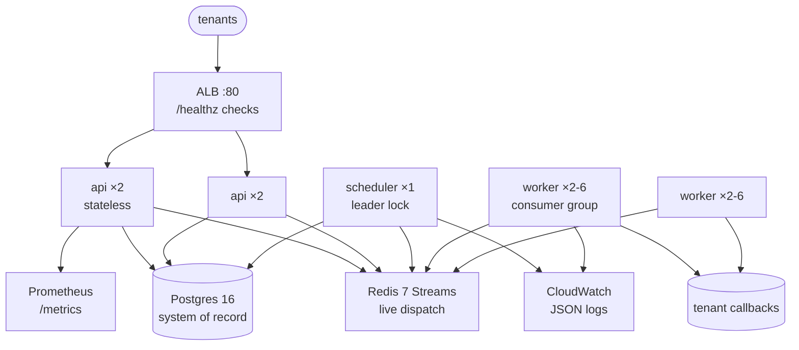

# Architecture — In Depth

Full annotated diagram: `docs/architecture.mmd`. Redis key map:
`docs/redis-keys.md`.

## The core bet: Postgres for truth, Redis for speed

Every state transition is a Postgres write (auditable, queryable, crash-safe);
Redis Streams carry only the *notification* that work is ready. This splits
failure modes cleanly:

- Redis lost → replays from Postgres-derived state; nothing acknowledged is
  forgotten because ACKs happen only after durable writes.
- Postgres slow → dispatch stalls visibly (`/healthz` 503, `queue_depth`
  alarm) instead of losing jobs silently.

The price is two systems to operate and one documented gap: the DB→Redis
handoff (API submit, cron spawn) has no transactional outbox yet — a crash in
that millisecond window leaves a row with no stream entry, logged loudly
(`needs reconciliation`) but requiring manual re-enqueue. The code comments
mark every such site; closing it with an outbox table + reconciler is the
single biggest durability upgrade available.

## Data flow, end to end

1. `POST /v1/jobs` → `jobs` row (`pending`) → `XADD jobs:ready` (immediate)
   or `ZADD jobs:scheduled` (future). `201` (+ `Location`-style `id`).
2. Scheduler (leader) promotes due members via Lua → `XADD jobs:ready`;
   spawns cron instances transactionally.
3. Worker `XREADGROUP` claims → `POST callback_url` (10 s, SSRF-pinned) →
   `job_executions` row + `jobs` status update + `XACK`.
4. Failure → `ZADD` backoff (generation+1) or `jobs:dead` + `status='dead'`.
5. Human/automation `POST …/retry` → attempts 0, generation+1, immediate.

Every leg logs `job_id` (API logs `request_id` + `job_id` on submit;
scheduler logs promotions; worker logs outcomes), so `grep job_id`
reconstructs a job's whole lifecycle across services.

## Scaling and availability

- **API**: stateless, scale on RPS/latency. Rate-limit state lives in Redis,
  so replicas share quota exactly.
- **Scheduler**: 1 active + N standbys via `SET NX PX` lock. Handoff ≤ ~TTL
  (30 s prod). Safe to over-provision standbys; only one dispatches.
- **Worker**: 2–6 on CPU (ECS) or `--scale` (compose). Linear scaling until
  Postgres connections (`DB_MAX_CONNS` × services < RDS `max_connections`)
  or tenant endpoints saturate.
- **Postgres**: RDS 16 (`db.t4g.micro`, 20/50 GB, backups 1/7 d, prod deletion
  protection + Performance Insights). Hot query is `(status, run_at)` — indexed.
- **Redis**: ElastiCache 7 single-node, SG-isolated, no AUTH/TLS inside the
  VPC (documented tradeoff: network isolation instead of encryption; enable
  both when compliance demands).

## Cost-shaped topology (deliberate, documented)

Tasks run in **public subnets with tight security groups** instead of private
subnets + NAT Gateway (~$32/mo saved); single-AZ-tolerant sizing; Spot
capacity for scheduler/worker with circuit breakers (API excluded from Spot
churn). Private subnets + NAT is the documented upgrade when budget allows.
Monthly cost budgets ($15 dev / $40 prod) alert to the same SNS topic as
outage alarms.

## Observability

- `/healthz` pings both dependencies (ALB target health = real readiness).
- `/metrics`: `jobs_submitted/completed/failed_total`, `queue_depth`
  (lag+pending, not naive `XLEN`).
- Alarms: job-failure rate, API 5xx, queue depth, ECS task-stopped
  (EventBridge), monthly budget — all → SNS.
- Structured JSON logs with `service`, `job_id`, `request_id`; redacted
  config snapshot on boot (`***` for DSN).

## Deployment

Local: `docker compose up` (api, scheduler, worker, postgres, redis,
migrate, callback sink, optional Caddy TLS profile). Prod: GitHub Actions →
OIDC-federated role (no static keys) → build/push `:sha` → new task-def
revisions → rolling deploy → `/healthz` smoke test (fail-closed) → SNS
alarms watch. Rollback = redeploy previous task-def revision. All infra is
Terraform (`terraform/`: networking, RDS, ElastiCache, ECR+IAM, ECS+ALB,
GitHub OIDC, budgets) with S3 state + DynamoDB locks and per-env tfvars.
